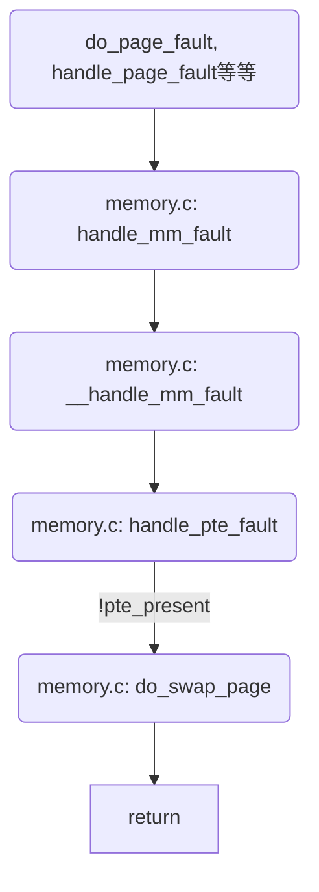
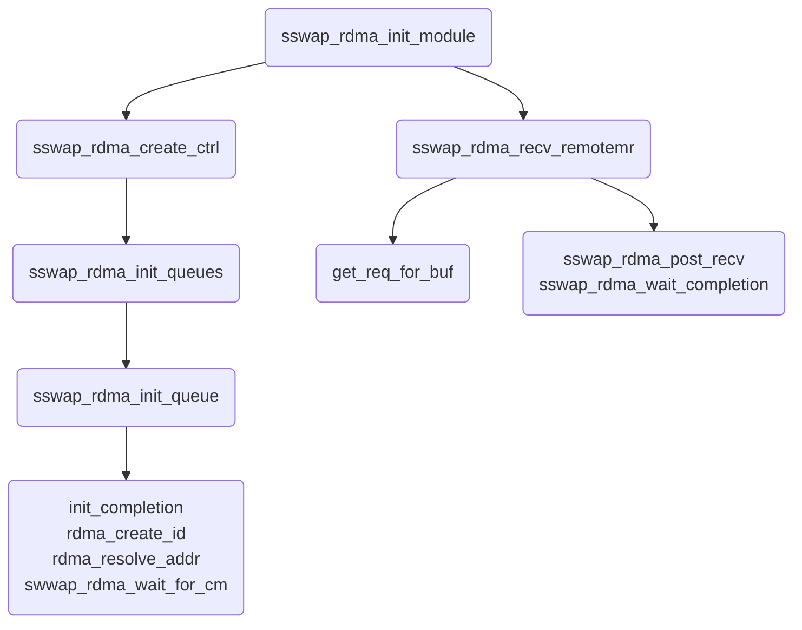
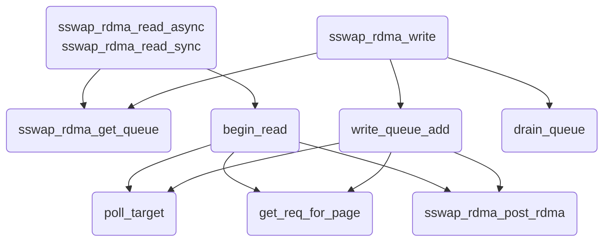
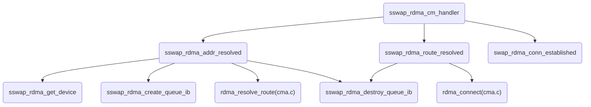

## Fastswap源码分析

### 1. Kernel修改的文件

- `include/linux/frontswap.h`
- `include/linux/swap.h`
- `mm/frontswap.c`
- `mm/memcontrol.c`
- `mm/page_io.c`
- `mm/swap_state.c`

- 主要工作：

  - 在`frontswap.c`中加入了`__frontswap_load_async, __frontswap_poll_load`，并修改了`frontswap.h`
  - 在`page_io.c`中加入了`swap_readpage_sync`，与`swap_readpage`进行区分，并修改了`swap.h`
  - 修改了`memcontrol.c`中的`high_work_func`与`memory_high_write`

  - 在`swap_state.c`加入了`read_swap_cache_sync`，与原来的`read_swap_cache_async`进行区分
  - 修改了`swap_state.c`的`swapin_readahead`，使用新加入的`read_swap_cache_sync`

- 调用

- ```mermaid
  graph TD
  
  AA(swap_state.c: read_swap_cache_async)
  A(page_io.c: swap_readpage)
  B(__frontswap_load_async,\n 通过EXPORT_SYMBOL暴露给内核\n但似乎没用到)
  
  
  H(frontswap.c: frontswap_shrink,\n 通过EXPORT_SYMBOL暴露给内核)
  I(swapfile.c: try_to_unuse)
  J(上接内核页错误处理)
  K(memory.c: do_swap_page)
  L(swap_state.c: swapin_readahead)
  M(swap_state.c: read_swap_cache_sync)
  N(page_io.c: swap_readpage_sync)
  O(frontswap.c: __frontswap_load,\n 通过EXPORT_SYMBOL暴露给内核\n但似乎没用到)
  L-->AA-->A-->B
  J-->K-->L-->M-->N-->O
  H-->I-->AA
  ```

- `frontswap_shrink`：

  - 外部程序调用`frontswap_shrink`，可以强制让frontswap管理的页面换出到可以被内核通过地址访问的内存中。	

- ```mermaid
  graph TD
  
  
  A("schedule_work_on(FASTSWAP_RECLAIM_CPU, &memcg->high_work);")
  B("memcontrol.c: try_charge")
  C("memcontrol.c: mem_cgroup_try_charge, mem_cgroup_charge_skmem, memcg_kmem_charge_memcg")
  C-->B-->A
  
  D("memcontrol.c: memory_high_show")
  D-->A
  
  
  Z(high_work_func)
  ```

- `high_work_func`在初始化`mem_cgroup_alloc`中被赋值给`memcg->high_work`

  - `memory_high_show`函数指针记录在`memcontrol.c: memory_files`这个列表中的一个元素
  - `memory_file`赋值给了`memory_cgrp_subsys.dfl_cftypes`
  - `memory_cgrp_subsys`用到的地方太多了


### 2. 内核页错误处理调用栈



### 3. driver调用方式

- 通过`frontswap_register_ops`函数，为frontswap注册了一个后端，frontswap根据注册时提供的函数指针完成内存块的操作。
- 使用了两个driver：fastswap.ko和fastswap_rdma.ko。
  - `fastswap_rdma.ko`：用来与远端内存进行交互
  - `fastswap.ko`：将rdma操作包装成能够被frontswap直接调用的接口。
- 为什么要用两个driver：因为还可以用`fastswap_dram.ko`。rdma与dram版本的driver对外暴露的符号是相同的，因此可以用fastswap进行复用，只需要选择想要的版本加载即可。

### 4. fastswap_rdma.c分析

- **初始化调用栈：**



- **读写调用栈：**
  - sswap_rdma_read与sswap_rdma_write的工作流类似，都是先获取queue，然后poll_target，在创建req，最后用sswap_rdma_post_rdma发布req。



- # **poll_load: TODO: 这是干嘛的？？**

- **sswap_rdma_cm_handler**: TODO: 这是干嘛的？

- 在`sswap_rdma_init_queue`中通过`queue->cm_id = rdma_create_id(&init_net, sswap_rdma_cm_handler, queue, RDMA_PS_TCP, IB_QPT_RC);`传递给queue->cm_id作为callback函数



  - 

