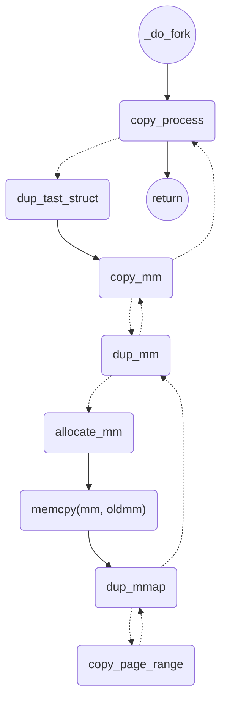

# Linux内核杂记

1. **likely(cond)与unlikely(cond)函数**

   - likely与unlikely不改变cond的真假，原样输出。但是可以向编译器**提供分支预测信息**：likely表示cond大概率为真，unlikely表示cond大概率为假

2. **EXPORT_SYMBOL**

   - 用于驱动编程。 EXPORT_SYMBOL标签内定义的函数或者符号对全部内核代码公开，不用修改内核代码就可以在您的内核模块中直接调用，即使用EXPORT_SYMBOL可以将一个函数以符号的方式导出给其他模块使用。

   - Linux内核由主内核vmlinux和许多内核模块构成，而在但是在静态链接阶段，模块之间的符号不互通，无法正常引用。因此，通过EXPORT_SYMBOL的导出这一符号。
   - 如：有的driver并不随着内核一起编译，而是内核启动之后再加载到内核中。这种情况，内核代码要使用driver的符号无法在编译时连接，需要driver通过EXPORT_SYMBOL对外暴露。
   - **疑问：内核要怎么引用这个符号呢**

3. **transcendent memory(tmem), frontswap**

   - tmem不同于普通的内存，其中存在的数据随时可能丢失，因此内核需要特殊的API来访问tmem。

   - 用处：
     1. 虚拟机管理器为多个虚拟机建立一个共同的内存池，用来动态平衡各个虚拟机的内存
     2. 在计算机集群中，网络访问速度高于外存访问速度，因此可以将各个节点的内存管理在一个池子中，用来交换内存中的页面。
     3. 内存压缩：对于内容相同的页面只保留一个

   - 管理文件页：
     - 内核换出的文件页被tmem管理起来，下次读取时就不需要从文件系统读取了
   - 管理匿名页：**frontswap**
     - 是”前端“接口，将需要管理的页面发送给tmem的后端。
     - 在 内核 swap 路径的前面, 截获了需要换出的匿名页, 放入 tmem 后端管理. 如果后端还有空闲资源的话, 这些页面被接收, 在内核需要这些页面时, 再把它们吐出来; 如果后端没有空闲资源了, 那么内核还是会把这些页面按原来的走 swap 路径写到交换设备中.
   - 后端**zram，zswap**
     - 是一个内存中的块设备，被内核格式化为一个一个swap设备，可以用来交换内存块。
     - 空间有限
     - 这是两个后端，后者要优秀一些

4. **Linux driver**

   - driver的两种加载方式：随内核一起编译、在内核运行后加载进来
   - 很好的教程：*https://www.apriorit.com/dev-blog/195-simple-driver-for-linux-os*
   - 例如：driver通常代表了一个块设备或字符设备，用户可以通过访问`/dev`下的文件与该driver交互。
   - driver向内核注册自己为字符设备的方法：在内核初始化时，通过`register_chrdev`函数注册，这个函数会返回一个结构体指针，driver通过设置结构体里的函数指针，向内核指明的driver实现了哪些方法，如`open, llseek, read, write`等。这样内核就可以通过调用这些函数来调用driver。

5. **内存分配**

   - `GFP_KERNEL`：向内核制定所分配的内存的性质，大部分时候都用`GFP_KERNEL`。其他还有`GFP_RECLAIM`、`GFP_NOWAIT`等
   - `kmalloc`：分配内存
   - `kzalloc`：分配内存并设置为0

6. **DMA mapping**

   - driver需要为DMA申请一块buffer，用来与内存进行交互。将“内核地址空间的buffer”映射到“DMA地址空间”的过程就是“DMA mapping"(或反过来映射)
   - 大多数情况下，从DMA地址转换到内核地址的过程由**IOMMU**这一硬件完成。
   - 用到的头文件`#include <linux/dma-mapping.h>`
   - **DMA Direction**：指定数据的移动方向（移动到main_memory或者device）
     - `DMA_BIDIRECTIONAL`
       `DMA_TO_DEVICE`
       `DMA_FROM_DEVICE`
       `DMA_NONE`：for debug。在确定好方向之前先设置为DMA_NONE，用来检测程序的DMA Direction逻辑是否出错。

7. **PageSwapCache(page)、PageLocked、PageUptodate**

   - 找不到定义（好奇怪）
   - 是一个page的标志位
   - 表示页面是否分配了swap空间

8. **BUG(), BUG_ON()**

   - BUG()：引发一个非法操作（比如给0地址赋值），从而导致栈的回溯、打印错误信息。**引发oops**
   - BUG_ON(cond)：当条件满足时触发oops

9. #### BUILD_BUG_ON_INVALID

   - `#define BUILD_BUG_ON_INVALID(*e*) ((*void*)(sizeof((__force *long*)(e))))`
   - 对于`sizeof(func(xxx))`，并不会生成、执行func(xxx)的代码。因此折个中可以仅仅让编译器检查表达式e的合理性，而不用执行该表达式。

10. ### 三种fork系统调用

    - https://blog.csdn.net/gatieme/article/details/51569932

    - sys_fork：子进程是父进程的完整独立副本
      - do_fork(SIGCHLD, regs.rsp, &regs, 0);
    - sys_vfork：与父进程共享数据段
      - _do_fork(CLONE_VFORK | CLONE_VM | SIGCHLD, 0,                        0, NULL, NULL, 0);
    - sys_clone：创建线程。Linux创建线程一般使用pthread库，但是也可以用clone
    - 底层都用do_fork实现
    - 

    ### 11. do_fork流程

    - 

    - 



```C
_do_fork(){
    copy_process(){
        struct tast_struct *p;
        p = dup_task_struct;
        init tast p;
        
        copy_semundo(p);
        copy_files(p);
       	...
        copy_mm(p){
        	set attributes of p;
        	initialize the new vmacache entries;
        	struct mm_struct *mm;
        	mm = dup_mm(p) {
        		struct mm_struct *mm = allocate_mm;
        		struct mm_struct *old_mm = current->mm;
        		memcpy(mm, oldmm);
        		mm_init;
        		dup_mmap(mm, oldmm) {
                    struct vm_area_struct *mpnt;
                    for (mpnt = oldmm->mmap; mpnt; mpnt = mpnt->vm_next) {
                        ...;
                        copy_page_range(mm, oldmm, mpnt) {
                            ...
                        }
                       
                    }
                    
                    ...
                }
        	}
        	p->mm = mm;
        }
        ...
        set pid(p)
        ...
    }
}
```

### 12. VMA

virtual memory area

用户进程拥有用户空间的地址，其可以通过malloc和mmap等函数来申请内存。malloc和mmap等函数的实现都基于进程线性区描述struct vm_area_struct。对于一个VMA，可以为其设定不同的规则（如代码段、数据段等）。记录了虚拟地址空间的起始和结束地址。

```C
struct vm_area_struct {
	/* The first cache line has the info for VMA tree walking. */

	/* VMA描述的线性地址空间的起始地址和结束地址（虚拟地址） */
	unsigned long vm_start;
	unsigned long vm_end;

	/* 进程VMA链表，分别指向前一个和后一个VMA。链表按虚拟地址大小排序 */
	struct vm_area_struct *vm_next, *vm_prev;

	/* VMA作为一个节点加入mm->mm_rb红黑树 */
	struct rb_node vm_rb;
    /* 指向VMA所属的mm_struct mm */
	struct mm_struct *vm_mm;
    ...
}
```


每个进程有一个内存描述符`struct mm_struct`，记录了vma的链表，以及由vma构成的红黑树，用于高效查找vma。

```C
struct mm_struct {
	struct vm_area_struct *mmap; /* list of VMAs */
	struct rb_root mm_rb;
	int map_count;			     /* number of VMAs */
    /* VMA访问权限 */
	pgprot_t vm_page_prot;
	/* VMA标志位 */
	unsigned long vm_flags; 
	...
}
```

