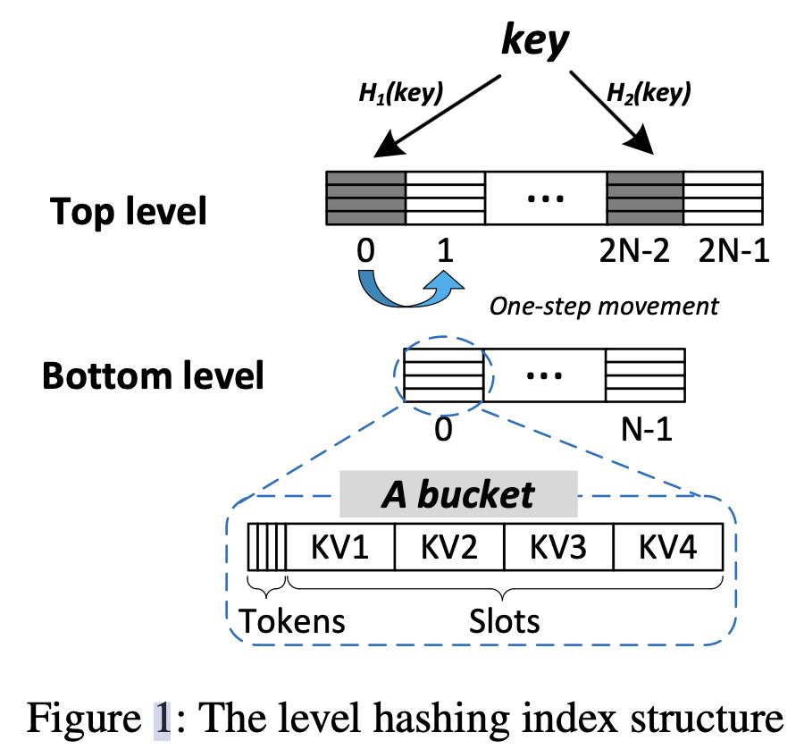

# Lock-free Concurrent Level Hashing for Persistent Memory

2020USENIX Annual Technical Conference，CCF-A

### Abstraction

- 在高内存密度、非易失性和DRAMscale延迟下，持久内存(PM)有望提高存储系统的性能。基于哈希的索引结构已广泛用于存储系统以提供快速查询服务。

- 最近的研究为 PM 提出了崩溃一致且写入高效的散列索引。然而，由于昂贵的基于锁的并发控制，多核并行编程在PM中效率低下。
- 为了解决PM中并发哈希索引的锁争用，我们提出了c级哈希(无锁并发级哈希)。
- 在 c 级散列中，我们设计了一个用于并发调整大小和查询的多层结构。调整大小操作由背景线程执行，而不阻塞并发查询。对于并发控制，利用原子原语实现无锁搜索/插入/更新/删除。我们进一步提出了上下文感知方案来保证交错查询的正确性。
- 使用真实的Intel Optane DC PMM，使用真实世界的YCSB工作负载的实验结果表明，与最先进的PM哈希索引相比，c级哈希获得了高达4.2倍的加速。

### 1. Introduction

- **PM(Persistent Memory)：**指一类支持字节寻址（byte-addressable）、可以通过 CPU 指令直接进行操作、断电后数据不丢失的存储硬件。现有的PM设备（2020年）读延迟大概是DRAM的三倍，而写延迟可以做到与DRAM相近。
- 对于PM来说建立高性能的**索引结构**非常重要，用于向大型存储系统提供快速查询服务
- crash consistency：
  - 保证当数据写入后，即使服务器崩溃了，数据也不会丢失、改变。
- 哈希
  - 当hash collision无法解决或者load factor（插入元素的数量/总容量）接近设定的阈值时，需要提高整个哈希表的容量（expansion，resize）。
  - 传统的expansion需要将旧表中的所有元素迁移到新表中。
- 前人工作：
  - Level hashing：是一种两层的PM hashing index，每次expand的时候只会将容量较小的level迁移到新的level。但是，这一操作是单线程的，且需要一个全局锁来保证数据一致性。**level hashing是本文作者之前的工作**
  - P-CLHT：CLHT（Cache-Line Hash Table）的变种。搜索操作时lock-free的，但是resize依旧需要全局锁
  - 以上两篇工作都收到全局锁的限制，resize的性能有限
  - 。。。
  - 总结：现有的PM hashing indexes在resize期间，并发性和可扩展性较差
- 说明一个scalable、concurrent的 PM hashing index 的重要性：
  - 如今的服务器可能有几十几百个线程，使得并发index structure广泛使用
  - 已久的方法都是利用lock实现线程间的数据同步，然而粗粒度的互斥锁增加了请求时延。
- 构建一个高性能的并发PM hashing index的挑战：
  - crash consistency
  - resize导致的性能下降：因为resize的时候需要粗粒度锁，期间许多请求都无法处理
  - lock-based并发控制的较差的可扩展性（scalability）**？？？？**
- 本篇文章工作
  - 基于level hashing
  - 提出了新的persisitent index方法，支持并发且开销小、性能好，达到了scalability和efficiency的平衡。
  - 为了减少resize时的性能下降：提出了动态多层索引结构（multi-level index structure）和异步rehash
    - 当resize时，会动态的增加level；当数据迁移完成后，会动态的删除之前的level。
    - 元素的rehash被卸载到background thread执行，因此不会阻碍主线程处理请求。
    - Background thread不断地将最后一level的元素放到第一个level中，直到仅剩两个level，保证了基本请求的处理时间是常数时间
  - 为了提供high scalabiliy和low latency：提出了insertion的优化，以及lock-free的concurrency control
    - insertion优化：插入新的元素时，会直接放到空slot中，避免了数据移动
    - **？？？**
    - 提出context-aware算法：通过检测metadata的变化，来保数据更新时的consistency。（重复的数据会在写入到哈希表前就删除）

### 2. Background

#### 2.1 Crash Consistency in Persistent Memory

- **假设CPU单次写入最大为8B**，但是如果需要写入的数据大于8B，那么在多次写入的过程中发生系统crash就会导致inconsistency。
- cache在write-back时的顺序和CPU指令的顺序是不同的，单次写入的大小超过了8B，因此也可能导致inconsistency。现代CPU提供了一些指令（如flush、memory barrier）来保证consistency，这些方式通过log或者CoW的机制实现，但是造成了PM application的过高负载。

#### 2.2 Lock-free Concurrency Control

- 当前的lock-free算法中，大多采用CAS（Compare-And-Swap）原语和CoW机制
- CAS：
  - 将存储的内容与预期内容进行比较。如果内容匹配，则存储的内容与新值交换。否则，预期内容使用存储的内容进行更新（或do nothing）
  - 缺点：CAS不支持大于CPU最大写入size的数据（8B）
- CoW
  - 被用来原子操作大于8B的数据。
  - 先将要更新的数据拷贝一份，再在副本上完成更新，再用CAS将指向原数据的指针指向副本
  - 缺点：额外的写入造成性能下降

#### 2.3 Basic Hash Tables

- 存储方式：
  - 直接在hash table中保存键值对，可变性差
  - 在hash table中保存一个指针，指向相应的键值对的方法（本文采用）
- hash collision处理：
  1. 分配更大的新表
  2. rehash旧表的所有元素到新表
  3. 切换到新表，销毁旧表

#### 2.4 Hashing-based Index Structures for PM

- **PM的写入带宽大概是DRAM的1/6，因此写效率非常重要**

##### 2.4.1 The Level Hasing Scheme

- 由于本篇的工作clevel hash是基于level hash的，因此简单介绍level hash的结构
- 

- 整个hash table由两层level构成，其中top level是bottom level的两倍大。每个level由多个bucket构成，一个bucket由四个slot和四个token构成，每个token是为了crash consistency存在的。
- 采用两个不同的hash函数，使得一个元素在一个level中有两个candidate bucket（两个level共计16个candidate slot），从而减少hash collision。
- 以slot为单位设置锁，存在两个并行问题
  1. 重复元素：当一个线程持有某个slot的锁，可能会有另一个线程插入一个重复的元素，由于slot被锁，就插到其他的candidate slot了，从而使hash table中出现重复元素
  2. 元素丢失：slot的锁无法阻止resize时移动元素（**？？？那你要了锁干什么？？？**），因此可能出现一个query已经锁定slot却查询到空的情况。

##### 2.4.2 Concurrent Hashing Indexes for PM

- 介绍了一些相关工作

### 3. The Clevel Hashing Design

- 要解决的三个问题：
  1. 支持resize操作的同时不阻碍其他线程的请求
  2. 避免并发执行中的锁争用
  3. 以较小的开销保证crash consistency
- 分为三个部分：
  - 3.1 动态multi-level结构
  - 3.2 lock-free并发控制
  - 3.3 crash recovery

#### 3.1 The Clevel Hashing Index Structure

##### 3.1.1 Dynamic Multi-level Structure

- 有多层level，上层的level大小是下层的两倍，最少有两个level。
- 每个bucket保存8个8B大小的slot，因此一个bucket是64B，刚好是一个cache line的大小
- 每个slot里保存了一个指针，指向相应的键值对

##### 3.1.2 The Support for Concurrent Resizing

- 由一个全局的context变量，保存了first level和last level的指针，以及一个is_resizing标志。

- 每个线程保存一个指向该context的指针。**可以通过CoW+CAS机制实现对context的原子修改**

- resize的步骤（太复杂了，暂不考虑失败情况）：

  1. 本地拷贝一份context
  2. 创建一个新的level，比原有的first level大两倍，并通过CAS更新原来first level的next指针，指向新的level
  3. 更新全局context的first level指针和is_resizing的值
  4. rehash原来last level的所有元素
  5. rehash完成后，更新last level指针和is_resizing的值

- ```C
  void resize() {
     	struct context* local_context = copy_global_context();
      struct level* new_level = create_level(size=global_context->first_level->size);
      
      if (!CAS(new_level, global_context->first_level->next)) {
          // CAS failed
          local_context->first
      }
  }
  ```

- **clevel使用Background thread进行rehashing**
  - resize过程中使用rehashing thread，可以用多个线程
  - Background thread不断地将最后一level的元素放到第一个level中，直到仅剩两个level，保证了基本请求的处理时间是常数时间

#### 3.2 Lock-free Concurency Control

##### 3.2.1 Search

##### 3.2.2 Insertion

##### 3.2.3 Update

##### 3.2.4 Deletion

#### 3.3 Recovery

clevel hashing在每次写入数据之后，都会添加cache line flush、memory fence，并持久化metadata（例如global context pointer）

针对crash consistency：当成功rehash一个bucket之后，就记录这个bucket的序号。需要从错误中恢复时，就可以从记录的bucket开始继续rehash

针对permanent memory leakage：

### 4. Performance Evaluation

