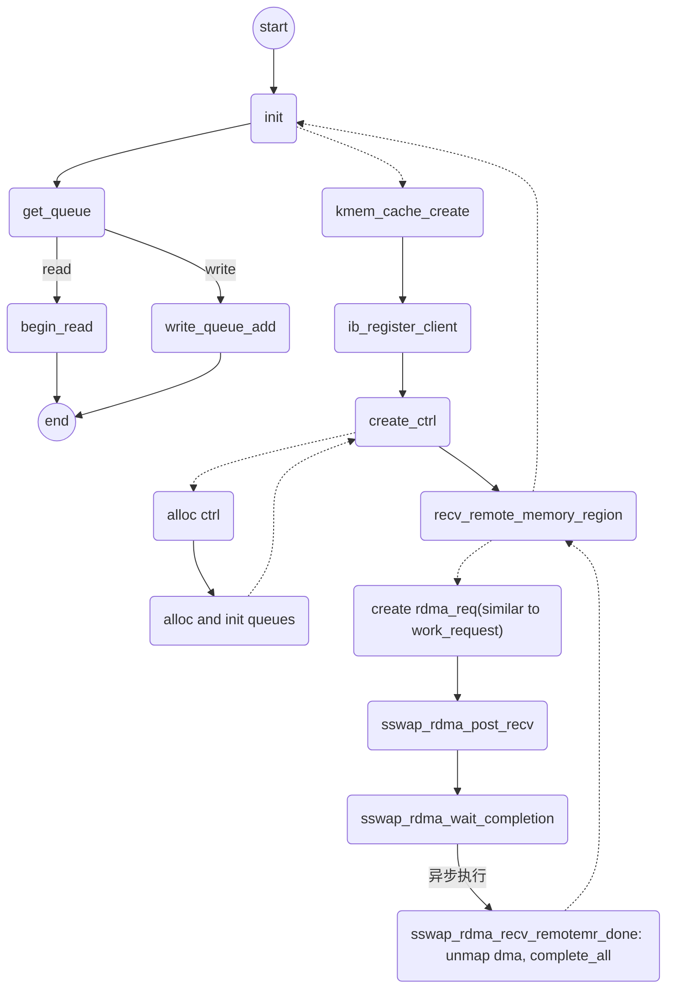

# RDMA杂记

### 1. SGE

- RDMA编程中，SGL(Scatter/Gather List)是最基本的数据组织形式。 SGL是一个数组，该数组中的元素被称之为SGE(Scatter/Gather Element)，**每一个SGE就是一个Data Segment(数据段)**。RDMA支持Scatter/Gather操作，具体来讲就是RDMA可以支持一个连续的Buffer空间，进行Scatter分散到多个目的主机的不连续的Buffer空间。Gather指的就是多个不连续的Buffer空间，可以Gather到目的主机的一段连续的Buffer空间。

### 2. 用户态rdma工作流

- ```mermaid
  graph TD
  
  A((start))
  B(setup ib)
  C(resigter_memory_region)
  D(post_read/write/send/received/_request)
  E(poll_completion)
  F((end))
  
  A-->B-->C-->D-->E-->F
  
  BA(create_context)
  BB(ibv_alloc_pd)
  BC(ibv_create_cq)
  BD(create_queue_pair)
  BE(change_queue_pair_state_to_INT)
  BF(change_queue_pair_state_to_RTR)
  BG(change_queue_pair_state_to_RTS)
  B-.->BA-->BB-->BC-->BD-->BE-->BF-->BG-.->B
  
  DA(create work request)
  DB(create send sge list)
  DC(copy ibv_mr to sge list)
  DD(setup work request)
  DE(ibv_post_recv/send)
  D-.->DA-->DB-->DC-->DD-->DE-.->D
  ```

### 3. 内核态rdma工作流



```mermaid
graph TD

A(begin_read)
B()
```


- 内核态工作流特点

